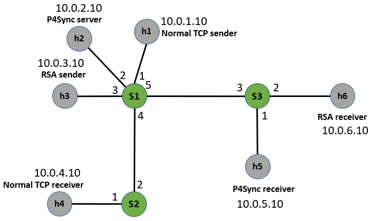

# Secure State Migration in the Data Plane

## Introudction
P4Sync is a data plane state synchronization protocol. It can synchronize state across P4 switches securely and completely with low overhead. The detailed deisgn of P4Sync can be found in paper: [Secure State Migration in the Data Plane (SPIN'20)](https://jxing.me/pdf/p4sync-spin20.pdf).


## Run the code

### Setup
We wrote P4Sync in P4 16 (bmv2) and tested it in Mininet. A Vagrantfile is provided to create the test environment. Just use the following command to create the test environment:
```
sudo apt-get update
sudo apt install virtualbox
sudo apt install ./vagrant_2.2.6_x86_64.deb
vagrant plugin install vagrant-disksize
vagrant up mininet
vagrant ssh mininet
sudo bash setup.sh
cd /vagrant # you will see the repo
```

We use the following topology. S1 is the source switch; S2 is the normal TCP destination; S3 is the synchronization destination. We use h2 to simulate the traffic generator that sends out synchronization packets periodically. We use h3 and h6 to simulate the switch control plane.
<p align="center">
  
</p>


### Run baseline
```
cd baseline
sudo bash run.sh
# in mininet
xterm h1 h4 h5
# in h4
sudo python recvNormal.py
# in h5
sudo python recvMigration.py
# in h1
cd ..
sudo python send.py

# h4 will print info of received normal TCP packets;
# h5 will print info of received synchronization packets and synchronization progress.
```

### Run P4Sync
```
cd p4sync
sudo bash run.sh
# in mininet
xterm h2 h3 h5 h6
# in h3
sudo python RSASender.py
# in h6
sudo python RSAReceiver.py
# in h5
sudo python recvMigration.py
# in h2
cd ..
sudo python send.py

# h3 will print info of received packets for RSA signatures;
# h5 will print info of received synchronization packets and synchronization progress.
# h6 will print info of RSA signature verification results;
```

## Citing
If you feel our paper and code is helpful, please consider citing our paper by:
```
@inproceedings{xing2020p4sync,
  title={Secure State Migration in the Data Plane},
  author={Xing, Jiarong and Chen, Ang and Ng, TS Eugene},
  booktitle={Proceedings of the Workshop on Secure Programmable Network Infrastructure (SPIN'20)},
  pages={28--34},
  year={2020}
}
```

## Contact
If you have any questions about of design and the code, please contact the author:
```
Jiarong Xing (jxing@rice.edu)
```

## License
The code is released under the [GNU Affero General Public License v3](https://www.gnu.org/licenses/agpl-3.0.html).


